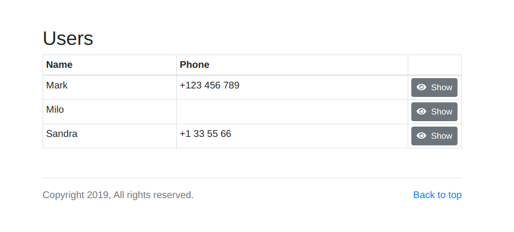
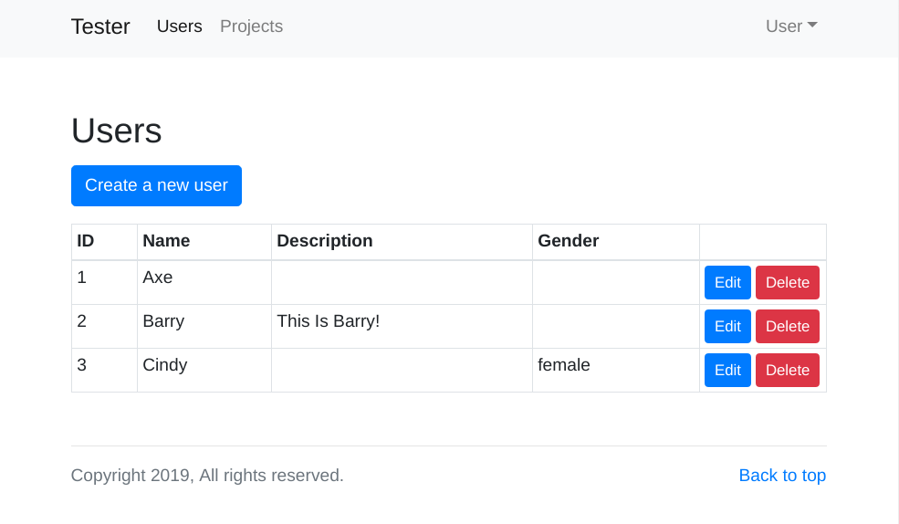
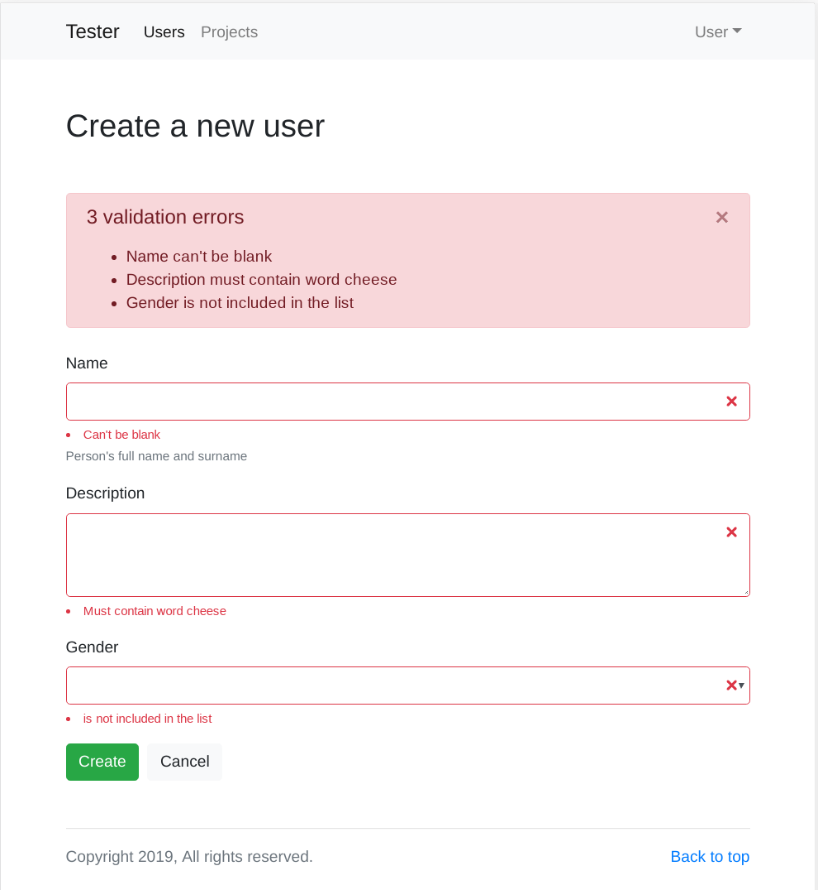
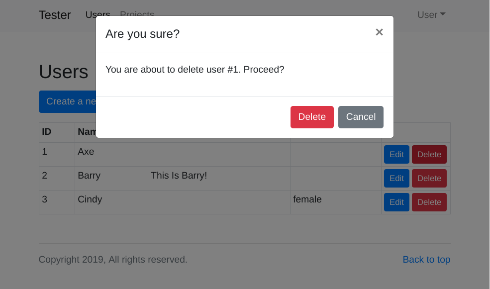

# CRUD UI

A "CMS-light" express.js router that serves UI for a single CRUD resource.

```bash
npm install --save crud-ui
```

### Simple example

```javascript
const http = require('http');
const express = require('express');

const crudUI = require('crud-ui');

const app = express();

app.use(
  '/',
  crudUI({
    name: 'user',
    recordId: 'id',
    fields: [
      {
        name: 'name',
        label: 'Name',
      },
      {
        name: 'phone',
        label: 'Phone number',
      },
    ],
    actions: {
      getList: () => {
        return [
          { name: 'Mark', phone: '+123 456 789' },
          { name: 'Milo', phone: '' },
          { name: 'Sandra', phone: '+1 33 55 66' },
        ];
      },
    },
  })
);

http.createServer(app).listen(3000);
```



### More details

The UI is rendered server-side using a vanilla [bootstrap](https://getbootstrap.com/) layout (feel free to slap your own [theme](https://bootswatch.com/) on top of it). Validation is performed by [validate.js](https://validatejs.org/), but you can plug in your own library. Every part of the UI in general is overridable through options.

Each crudUI serves a single REST-like resource - a table view with items, edit item and delete. You can use multiple crudUI handlers to work with multiple resources. We provide an option of adding a top level menu, so you can navigate between them (and/or other parts of your app).

As the name says, this library is for the UI layer only. Since you are providing functions which resolve various operations, you can plug whatever database or other backend you want. We also don't do authentication. It is recommended to plug in your own auth middleware before the crudUI handler is reached.

To summarize:

##### This library is for you if:

- You already have a node.js app and just want to plug in a little configuration screen so that sales people can tweak a few options or something.

- You don't want CMS to dictate your backend. You are using a 3rd party store, already have a database or just want to structure your backend and API how you like it.

- You have straightforward UI requirements - basic server-side rendered CRUD with flat objects.

- You have relatively little data to manage (we don't support pagination yet).

- You like self-contained low-impact libraries. We have very few direct dependencies, plus 2 peer dependencies (against `express.js` and `body-parser`).

##### This library is NOT for you if:

- You want a fully managed CMS solution with minimal coding (instead, see [strapi](https://strapi.io/) , for example).

- You want to serve an interface towards customers. Our UI is functional, but simple and generic looking. While you can overwrite every view with your own code, if you start doing that all the time, maybe it's time to put up a real UI :-)

- You have a complicated object model, requiring advanced entity relations or crazy tree views

- You want to make a blog. We don't have a WYSIWYG editor yet.

### Advanced example

```javascript
const http = require('http');
const express = require('express');

const port = process.env.PORT || 3000;

const { crudUI, CUIField, FIELD_TYPES } = require('crud-ui');

const app = express();

const data = [
  { id: 1, name: 'Axe' },
  { id: 2, name: 'Barry', description: 'This\nIs\nBarry!' },
  { id: 3, name: 'Cindy', gender: 'female' },
];

app.use(
  '/admin/users',
  crudUI({
    name: 'user',
    recordId: 'id',
    navigation: {
      brand: {
        title: 'Tester',
        url: '/admin/users',
      },
      left: [
        {
          title: 'Users',
          url: '/admin/users',
        },
        {
          title: 'Projects',
          url: '/admin/projects',
        },
      ],
      right: [
        {
          title: 'User',
          items: [
            {
              title: 'Home',
              url: '/admin/users',
            },
            {
              title: '---',
            },
            {
              render: (/** CUIContext */ ctx) => {
                return `<button class="dropdown-item" onclick="alert('logout')">Log out</button>`;
              },
            },
          ],
        },
      ],
    },
    fields: [
      new CUIField({
        type: FIELD_TYPES.string,
        name: 'id',
        label: 'ID',
        noEdit: true,
      }),
      new CUIField({
        type: FIELD_TYPES.string,
        name: 'name',
        label: 'Name',
        helpText: "Person's full name and surname",
        validate: {
          presence: {
            allowEmpty: false,
          },
        },
        validateEdit: {
          length: { minimum: 20 },
        },
      }),
      new CUIField({
        type: FIELD_TYPES.text,
        name: 'description',
        label: 'Description',
        validateCreate: (ctx, val) => {
          if (val.indexOf('cheese') < 0) {
            return 'must contain word cheese';
          }
        },
      }),
      new CUIField({
        type: FIELD_TYPES.select,
        name: 'gender',
        label: 'Gender',
        values: ['male', 'female', 'other'],
        nullOption: true
      }),
    ],
    actions: {
      getList: ctx => {
        return data;
      },
      getSingle: (ctx, id) => {
        return data.find(item => String(item.id) === String(id));
      },
      create: (ctx, payload) => {
        const id = data.reduce((max, item) => Math.max(item.id, max), 0) + 1;
        const item = { ...payload, id };
        data.push(item);
        return item;
      },
      update: (ctx, id, payload) => {
        const existing = data.find(item => String(item.id) === String(id));
        if (!existing) {
          throw new Error(`Not found: ${id}`);
        }
        Object.assign(existing, payload);
        return existing;
      },
      delete: (ctx, id) => {
        const index = data.findIndex(item => String(item.id) === String(id));
        if (index < 0) {
          throw new Error(`Not found: ${id}`);
        }
        const item = data.splice(index, 1)[0];
        return item;
      },
    },
  })
);

app.get('/', (req, res) => {
  return res.set('content-type', 'text/html').send(`
  <body>
    <h1>This is just a tester</h1>
    <h4>
      <a href="/admin/users">Go to admin</a>
    </h4>
  </body>
  `);
});

const server = http.createServer(app);
server.listen(port, () => {
  console.log(`Listening on http://localhost:${port}`);
});
```







### Development

Follow the development and TODO-s here: <https://trello.com/b/3vSgeUxa/crudbutquick>

#### NOTE

**This project is in very early stages of development. Lots of things are still missing. Nothing is battle tested in production. At this stage, we don't recommend using it for mission critical systems.**

### License

[MIT](https://opensource.org/licenses/MIT)
 

